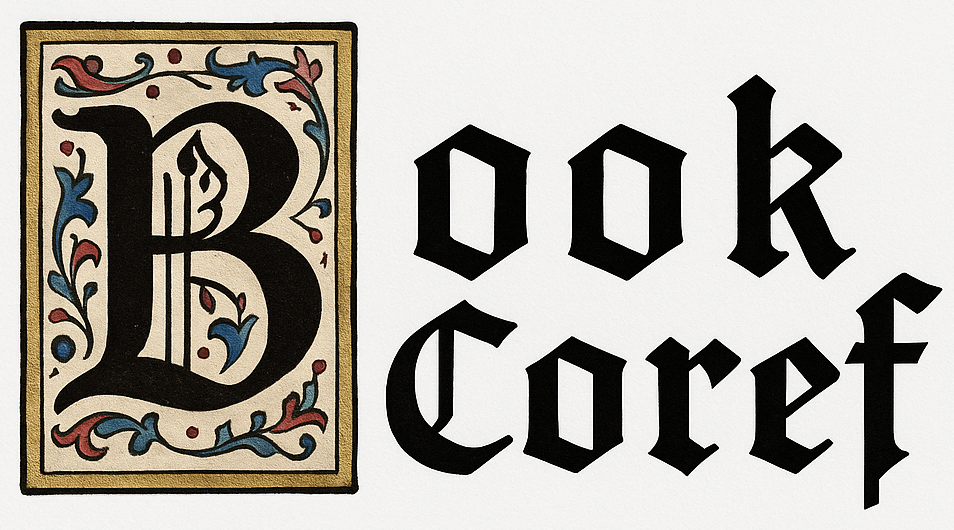

<div align="center">
  

</div>

<div align="center">


[](https://2025.aclweb.org/)
[](https://aclanthology.org/)
[](https://arxiv.org/abs/2507.12075)
[](https://huggingface.co/collections/sapienzanlp/relik-retrieve-read-and-link-665d9e4a5c3ecba98c1bef19)
[](https://creativecommons.org/licenses/by-nc/4.0/)
</div>


##  Description
This repository contains the official code for the ACL 2025 main conference paper: [<span style="font-variant: small-caps;">BookCoref</span>: Coreference Resolution at Book Scale](https://arxiv.org/abs/2507.12075).
We include the official outputs of the comparison systems outlined in the paper, which can be used to reproduce our results.
Our silver training and gold evaluation data are available through this [🤗 Hugging Face dataset](https://huggingface.co/datasets/sapienzanlp/bookcoref).
This work was conducted by [Giuliano Martinelli](https://www.linkedin.com/in/giuliano-martinelli-20a9b2193/), [Tommaso Bonomo](https://www.linkedin.com/in/tommaso-bonomo/), [Pere-lluìs Huguet Cabot](https://www.linkedin.com/in/perelluis/) and [Roberto Navigli](https://www.linkedin.com/in/robertonavigli/).
## Setup 

First of all, clone the repository: 
```bash
git clone https://github.com/sapienzanlp/bookcoref.git
```

Then, create a Python virtual environment and install the requirements. We support Python 3.9 and above.
```bash
pip install -r requirements.txt
```

## <span style="font-variant: small-caps;">BookCoref</span> Data

### Local Download
To download the <span style="font-variant: small-caps;">BookCoref</span> data for training and evaluation, run the `download_data.py` script:
```bash
python download_data.py

options:
  --format <"jsonl" or "conll">, default="jsonl" # Format of the dataset to download
  --configuration <"default" or "split">, default="default" # Configuration of the huggingface dataset, either 'default' or 'split'
  --output_dir <path>, default="data/" # If specified, the output directory for the dataset
```

This script will download data from [🤗 Hugging Face](https://huggingface.co/datasets/sapienzanlp/bookcoref) and save it in either JSONL or CoNLL format to the default directory `data/`.

### Data format
<span style="font-variant: small-caps;">BookCoref</span> is a collection of annotated books. Each item contains the annotations of one book following the structure of OntoNotes:

```python
{
  doc_id: "pride_and_prejudice_1342", # (str) i.e., ID of the document 
  gutenberg_key: "1342", # (str) i.e., key of the book in Project Gutenberg
  sentences: [["CHAPTER", "I."], ["It", "is", "a", "truth", "universally", "acknowledged", ...], ...], # list[list[str]] i.e., list of word-tokenized sentences
  clusters: [[[79,80], [81,82], ...], [[2727,2728]...], ...], # list[list[list[int]]] i.e., list of clusters' mention offsets
  characters: [
    {
      name: "Mr Bennet", 
      cluster: [[79,80], ...],
    },
    {
      name: "Mr. Darcy",
      cluster: [[2727,2728], [2729,2730], ...],
    }
  ] # list[character], list of characters objects consisting of name and mentions offsets, i,e., dict[name: str, cluster: list[list[int]]]
}
```

We also include informations on character names, which is not exploited in traditional coreference settings, but could be useful in future work.

## <span style="font-variant: small-caps;">BookCoref</span> Evaluation

To evaluate the outputs of a model on the <span style="font-variant: small-caps;">BookCoref</span> benchmark, run the `evaluate.py` script:

```bash
python evaluate.py

options:
  --predictions <path_to_predictions> # Path to the predictions file to evaluate.
  --mode <"full", "split", "gold_window">, default="full" # Evaluation mode.
```

We provide three evaluation modes:

| Mode | Description |
|-------|-------------|
| `full`| Evaluate model predictions on the full books of `test.jsonl`. <br/> *Input*: expects as input predictions on the full test set books. <br/> *Output*: scores on the full books of `test.jsonl`, referred to as <span style="font-variant: small-caps;">BookCoref</span><sub>gold</sub> results in our paper. |
| `split` | Evaluate model predictions on `test_split.jsonl`. <br/> *Input*: expects as input predictions on the split version of our test set books. <br/> *Output*: scores on the split version (`test_split.jsonl`), referred to as <span style="font-variant: small-caps;">Split-BookCoref</span><sub>gold</sub> results in our paper. |
| `gold_window` | Evaluate model predictions carried out on the full `test.jsonl` but evaluated on `test_split.jsonl`, by splitting clusters every 1500 tokens. <br/> *Input*: expects as input predictions on the full test set books. <br/> *Output*: scores on the split version (`test_split.jsonl`), referred to as <span style="font-variant: small-caps;">BookCoref</span><sub>gold+window</sub> results in our paper. |

## Replicate Paper Results
To replicate the results of our paper, run `evaluate.py` specifying the path to the predictions of the model you are interested in. 

Example:
```bash
$ python evaluate.py --predictions predictions/finetuned_bookcoref/maverick_xl.jsonl
Evaluation Results:
muc:
  precision: 92.95
  recall: 95.70
  f1: 94.30
b_cubed:
  precision: 43.08
  recall: 77.19
  f1: 55.30
ceafe:
  precision: 37.10
  recall: 30.46
  f1: 33.45
conll2012:
  precision: 57.71
  recall: 67.78
  f1: 61.02
```

## Citation
This work has been published at ACL 2025 (main conference). If you use any artifact, please cite our paper as follows:

```bibtex
@inproceedings{martinelli-etal-2025-bookcoref,
    title = "{BOOKCOREF}: Coreference Resolution at Book Scale",
    author = "Martinelli, Giuliano  and
      Bonomo, Tommaso  and
      Huguet Cabot, Pere-Llu{\'\i}s  and
      Navigli, Roberto",
    booktitle = "Proceedings of the 63nd Annual Meeting of the Association for Computational Linguistics (Volume 1: Long Papers)",
    month = jul,
    year = "2025",
    address = "Vienna, Austria",
    publisher = "Association for Computational Linguistics",
}
```


## License

The data and software are licensed under [Creative Commons Attribution-NonCommercial-ShareAlike 4.0](https://creativecommons.org/licenses/by-nc-sa/4.0/).

